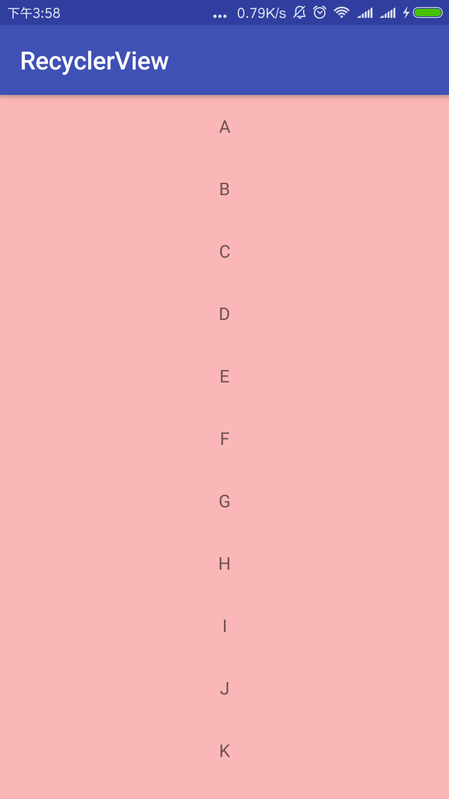
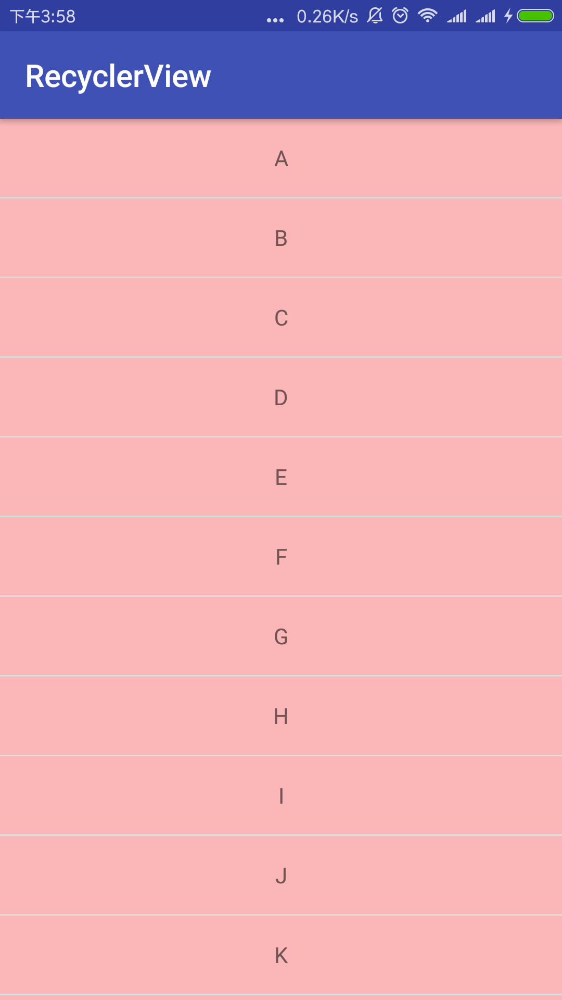

> RecyclerView提供了一种插拔式的体验，高度的解耦，异常的灵活，通过设置它提供的不同LayoutManager，ItemDecoration , ItemAnimator实现丰富的效果。

- 你想要控制其显示的方式，请通过布局管理器LayoutManager
- 你想要控制Item间的间隔（可绘制），请通过ItemDecoration
- 你想要控制Item增删的动画，请通过ItemAnimator
- 你想要控制点击、长按事件，请自己写


##基本使用

鉴于我们对于ListView的使用特别的熟悉，对比下RecyclerView的使用代码：

```Java
mRecyclerView = findView(R.id.id_recyclerview);
//设置布局管理器
mRecyclerView.setLayoutManager(layout);
//设置adapter
mRecyclerView.setAdapter(adapter)
//设置Item增加、移除动画
mRecyclerView.setItemAnimator(new DefaultItemAnimator());
//添加分割线
mRecyclerView.addItemDecoration(new DividerItemDecoration(
                getActivity(), DividerItemDecoration.HORIZONTAL_LIST));
```

相比较于ListView的代码，ListView可能只需要去设置一个adapter就能正常使用了。而RecyclerView基本需要上面一系列的步骤。从它类名上看，
RecyclerView代表的意义是，我只管Recycler View，也就是说RecyclerView只管回收与复用View，其他的你可以自己去设置。
可以看出其高度的解耦，给予你充分的定制自由（所以你才可以轻松的通过这个控件实现ListView,GirdView，瀑布流等效果）。



##添加分割线

> RecyclerView并没有支持divider这样的属性，你可以给Item的布局去设置margin，这种方式不够优雅，当然我们的分割线也是可以定制的。
我们可以通过`mRecyclerView.addItemDecoration()`方法添加分割线.
该方法的参数为`RecyclerView.ItemDecoration`，该类为抽象类，官方目前并没有提供默认的实现类。 

当我们调用mRecyclerView.addItemDecoration()方法添加decoration的时候，RecyclerView在绘制的时候，去会绘制decorator，即调用该类的onDraw和onDrawOver方法，
- onDraw方法先于drawChildren
- onDrawOver在drawChildren之后，一般我们选择复写其中一个即可。
- getItemOffsets 可以通过outRect.set()为每个Item设置一定的偏移量，主要用于绘制Decorator。
```Java
    public static abstract class ItemDecoration {
        
        public void onDraw(Canvas c, RecyclerView parent, State state) {
                    onDraw(c, parent);
         }
        public void onDrawOver(Canvas c, RecyclerView parent, State state) {
                    onDrawOver(c, parent);
         }
        public void getItemOffsets(Rect outRect, View view, RecyclerView parent, State state) {
                    getItemOffsets(outRect, ((LayoutParams) view.getLayoutParams()).getViewLayoutPosition(),
                            parent);
        }
        @Deprecated
        public void getItemOffsets(Rect outRect, int itemPosition, RecyclerView parent) {
                    outRect.set(0, 0, 0, 0);
         }
```

实现类参见：com.openxu.recyclerview.view.DividerItemDecoration



DividerItemDecoration中通过读取系统`listDivider`属性值将系统默认的分割线设置给RecyclerView。
我们可以在theme.xml中找到该属性的使用情况，并设置`listDivider`属性值。
```xml
    <style name="AppTheme" parent="AppBaseTheme">
      <item name="android:listDivider">@drawable/divider_bg</item>  
    </style>
```
divider_bg.xml：
```xml
<?xml version="1.0" encoding="utf-8"?>
<shape xmlns:android="http://schemas.android.com/apk/res/android"
    android:shape="rectangle" >
    <gradient
        android:centerColor="#ff00ff00"
        android:endColor="#ff0000ff"
        android:startColor="#ffff0000"
        android:type="linear" />
    <size android:height="4dp"/>
</shape>
```


##LayoutManager

上面实现了类似ListView的效果，通过使用其默认的LinearLayoutManager。

RecyclerView.LayoutManager吧，这是一个抽象类，系统提供了3个实现类：

- LinearLayoutManager 现行管理器，支持横向、纵向。
- GridLayoutManager 网格布局管理器
- StaggeredGridLayoutManager 瀑布就式布局管理器

接下来看GridLayoutManager，尝试去实现类似GridView：
```Java
//mRecyclerView.setLayoutManager(new LinearLayoutManager(this));
mRecyclerView.setLayoutManager(new GridLayoutManager(this,4));
```

当然了，改为GridLayoutManager以后，对于分割线，前面的DividerItemDecoration就不适用了，主要是因为它在绘制的时候，比如水平线，针对每个child的取值为：
```Java
final int left = parent.getPaddingLeft();
final int right = parent.getWidth() - parent.getPaddingRight();
```
因为每个Item一行，这样是没问题的。而GridLayoutManager时，一行有多个childItem，这样就多次绘制了，并且GridLayoutManager时，Item如果为最后一列（则右边无间隔线）或者为最后一行（底部无分割线）。

因此，我们编写了DividerGridItemDecoration分割线。


看到这，你可能还觉得RecyclerView不够强大？

但是如果我们有这么个需求，纵屏的时候显示为ListView，横屏的时候显示两列的GridView，我们RecyclerView可以轻松搞定，而如果使用ListView去实现还是需要点功夫的.


